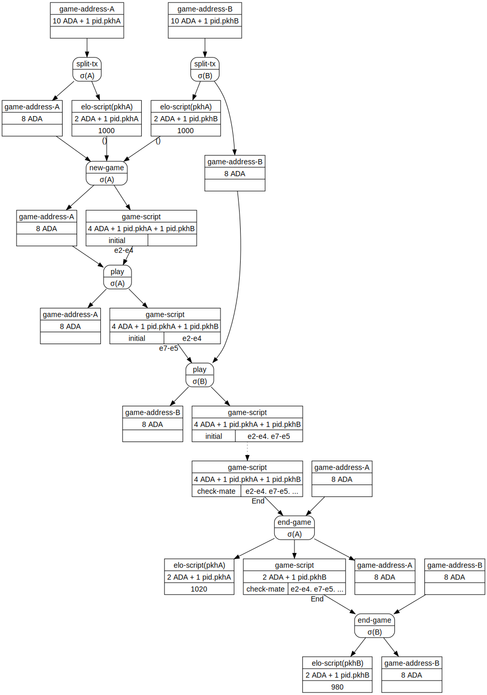
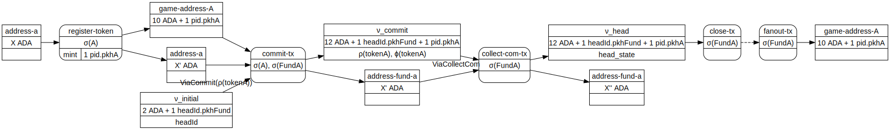

# Developing a Chess Game on Hydra

## Goals & Constraints

* The application should be easy to install and run, with basically
  zero configuration needed and very few knowledge about smart
  contracts, Cardano, layer 2, etc. from the part of the player(s)
* The client should be independent from the Cardano implementation and
  rely on generally available tools to interact with the layer 1 and
  2, eg. cardano-cli
* The client should be independent from Hydra implementation, and rely
  only on basic web API components: HTTP(S), Websockets, JSON
* The validity of game moves must be fully verified on-chain, making
  it impossible for a player to make an illegal move

## Easy install & zero-conf

* Installing a cardano-node is already a non-trivial process:
  * Binaries are only available for [some
    platforms](https://github.com/IntersectMBO/cardano-node/releases/tag/8.7.1-pre),
    and sometimes [not even
    unavailable](https://github.com/IntersectMBO/cardano-node/releases/tag/8.7.2)
  * One then has to unpack an archive comprising 10s of programs,
    libraries, and configuration files, and run it without much
    guidance (the archive does not contain a `README.md` or a user
    guide)
  * Another popular option is to build the cardano-node from source,
    either through
    [nix](https://github.com/input-output-hk/cardano-node-wiki/blob/main/docs/getting-started/building-the-node-using-nix.md)
    which is the recommended way, or [from
    "scratch"](https://github.com/input-output-hk/cardano-node-wiki/blob/main/docs/getting-started/install.md),
    but this requires a lot of time, disk space, CPU and RAM, and is
    quite an error-prone process
* Running a cardano-node on one of the public test networks or on
  `mainnet` is by contrast a straightforward process: Point the node
  to the publicly available configuration files and there you go
  * The only tricky part is getting the "right" configuration files:
    The canonical configuration files for the _latest_ version of the
    cardano-node and networks are available on the
    [cardano.org](https://book.world.dev.cardano.org/environments.html)
    website, but it's impossible to know from their URL which version
    they apply to
  * The situation has improved in recent releases as the configuration
    files are now packed with the archive, albeit with a different
    naming scheme
  * Also of note is the time needed to sync up a public network, a process that takes hours or days. This issue is easily solved with [Mithril](https://mithril.network) but unfortunately teh current snapshots are built for cardano-node 8.1.2 which still comprises the [majority of nodes](https://pooltool.io/networkhealth) in the network
* The situation is reversed for Hydra: Installing a hydra-node is
  simpler as there's only one important executable to install, namely
  the `hydra-node`, while configuring and running a hydra-node is
  quite an [involved
  process](https://hydra.family/head-protocol/docs/tutorial/). In
  particular:
  * One needs to have some funds ready at an address controlled by the hydra-node, which implies generating keys for both Cardano signing and Hydra signing
  * The hydra-node requires up-front knowledge about the parties it needs to connect to, their addresses and their keys
  * Also of importance is the transaction id relevant to the cardano network, in order to be able to post the Head protocol transactions (they are now [available in the code repository](https://raw.githubusercontent.com/input-output-hk/hydra/0.14.0/networks.json))

The [hygames](games-hydra/app/games-hydra.hs) executable aims at taking care of all those nitty-gritty details and provide a turnkey experience to the user which basically should be able to be up and running with a single command pointing to a given network, eg.:

```
hygames --network Preview
```

To this aim, the executable currently:
* Downloads executables and configuration files from reference sources according to version (when they are available)
* Uses XDG to manage installation directories, configurations, and data (eg. cardano-node database and hydra-node's state)
* Generates needed keys when they do not exist, requesting funding from the user who can then use a standard wallet to send those funds to the hydra-node
* Wraps-up and control both executables, trying as much as possible to ensure they stay in sync

## Cardano & Hydra API

* I wrote the application in Haskell but wanted it to be _independent_ from the existing Haskell [cardano-api](https://github.com/IntersectMBO/cardano-api)
  * The Cardano API evolved mostly as an insulation layer between the cardano CLI and node applications and the internal details of the ledger and the consensus, but it still [depends](https://github.com/IntersectMBO/cardano-api/blob/main/cardano-api/cardano-api.cabal#L152) on those packages and therefore pulls in a lot of dependencies which are not needed for a client application
* The client therefore exclusively uses the [cardano-cli](https://github.com/IntersectMBO/cardano-cli) to interact with the Cardano network and to construct transactions to be submitted to the Hydra Head
* The smart contracts part being written in PlutusTx, it of course depends and uses Plutus compiler and libraries but this is expected and would be the case if I had written the contracts in Aiken or plu-ts
* The client code is however not entirely decoupled from the Haskell SDK because of the need to encode datums and redeemers in transactions using a specific format (JSON encoding of Plutus API's `BuiltinData`)
  * The core layer provides functions to convert Haskell types into the required formats. This means the client layer still depends on the core types which does not achieve the desired decoupling
  * The grammar of datums and redeemers is [relatively simple](https://github.com/input-output-hk/plutus/blob/0e3c20b536bcd705dd55224b90a79241a23acfee/plutus-core/plutus-core/src/PlutusCore/Data.hs#L41) and providing conversion functions would be easy
  * :bulb: Clients should be able to provide redeemers and datums directly in JSON
* Providing an SDK covering all of Cardano data structures is a lot of work, especially if one takes into account past Eras, blocks, etc. as exemplified by [Pallas](https://github.com/txpipe/pallas) which is the Rust analog of Cardano API

## On-Chain Game

The following diagram represents the In-Head flow of transactions to run a series of game between 2 players:



Some notes about the overall process:
* :facepalm: The initial `split-tx` exists because I failed to realise Hydra was now allowing more than one TxOut commit
* The `pid.pkhA` token represents the player in the game
  * I initially thought of using a native tokens that players would exchange to represent their Elo but then nothing would prevent a player to give away Elos to some other player so this needs to be controlled by a spending script and not only a monetary policy
  * I also thought of minting and burning tokens with same policy but different names to represent changes in Elo ratings following a game, eg. given a player with `1800 pid.pkhA` "Elo" beats a player with `2005 pid.pkhB` Elo, there would be a minting of `15 pid.pkhA` tokens and conversely a burning of `-15 pid.pkhB` tokens representing the change in Elo
  * However minting/burning across a Head is not currently easy (one would need to ensure the Fanout transaction witnesses the policy Id and the latter allows burning/minting in this context)
* I therefore partially switched to use a `elo-script(pkhX)` which is supposed to be a script controlling the [Elo rating](https://en.wikipedia.org/wiki/Elo_rating_system) of the player, a part which is not currently implemented.
  * The idea is that spending this script is only allowed to start a game in which the corresponding player is playing, and the outcome of a game generates a new rating controlled by the same script
* The rest of the flow is mostly straightforward and controlled by the `Chess.Contract`'s validator:
  * A player's move is the redeemer for spending UTxO containing current state of the board, encoded as 2 positions (eg. `e2-e4`)
  * The contract's output datum is the new state whose validity is verified by the smart contract
  * The game ends when a check mate is detected at which point no further move is possible
  * Then each player can collect their "gains" and recover their game token by submitting a transaction with an `End` redeemer, the last player to do so consuming the contract's output completely
  * Note the end game logic is currently not properly coded
* While a head is open any player can start a new game

The Layer 1 flow of transaction is mostly uninteresting but I still put it here for the records.




* The core logic of the game is coded as a PlutusTx module [Chess.Game](https://github.com/abailly/black-jack/blob/1acd49f61e7f2ae55096f37d5342c6caca840644/black-jack-core/src/Chess/Game.hs#L1)
  * A nice (and intended) consequence of writing the smart contracts in PlutusTx is that I was able to Test-Drive its development using [QuickCheck properties](https://github.com/abailly/black-jack/blob/1acd49f61e7f2ae55096f37d5342c6caca840644/black-jack-core/test/Chess/GameSpec.hs#L45)
* The [validator](https://github.com/abailly/black-jack/blob/1acd49f61e7f2ae55096f37d5342c6caca840644/black-jack-core/src/Chess/Contract.hs#L33) does not fully enforce the above transaction flow, in particular it does not check authorizations to play, nor does it correctly compute the end game situation
* Validating a single play is very costly: To make the transaction pass in the Hydra ledger I have had to beef up the execution budget to something like _500 billion_ CPU steps (the current maximum per transaction in Cardano is 10 billion).

## The Good

* The Hydra WS API is easy to work with and points the client to be implemented as a straightforward reactive application which is definitely intended
  * Having a [documented JSON schema](https://hydra.family/head-protocol/api-reference#schema-UTxOWithWitness) was helpful to build the UTxO with script information when I was trying to commit scripts in the Head, although the published documentation could be improved
* It's a testimony to the Layer 2 isomorphism one can use the same tool (eg. `cardano-cli`) to build transactions for the Layer 1 and for hydra. Of course, one cannot use `transaction build` and needs to use the cruder and less friendly `transaction build-raw` but with properly massaged protocol parameters, this becomes straightforward
* Once climbed the learning curve needed to learn the quirks of the cardano-cli and the proper flow to build, sign and submit transactions, the process is repetitive and there's not so many moving parts
  * This means that implementing a SDK or an API covering the 90% use cases and handling the "standard" transaction flows should be a relatively simple task
* Having the state of the game stored in the chain and persisted by Hydra is very convenient from a client perspective as it makes it basically stateless and therefore more versatile and resilient

## The Bad

* The overall developer experience interacting with Cardano, and Hydra too, _must_ definitely be [improved](#the-ugly) in order to make this kind of development faster, safer, easier, something that developers who don't have several years of hands-on experience dealing with transactions and smart contracts can approach confidently
* Regarding Hydra specifically, the main problem is the peers discovery and connectivity "process", which currently makes it quite hard to run such kind of end-users focused application as the hydra-node process currently requires knowledge of all the information about its peers up-front (cardano keys, hydra keys, ip/port)
  * While I can think of ways to overcome this issue for the particular case of a Chess game (or similar application), for example by allowing users to register peers and share their own information _before_ starting a game, this does not scale easily to running multiple concurrent games (where each series of game with another player is a single head)
  * And of course it does not lend itself to supporting multiple DApps with the same infrastructure (eg. a single hydra-node/server and cardano-node)
  * The use of a P2P TCP-based networking model means that every head needs a different port and direct connection to each peer
* The programming model I have chosen, to represent directly the game's state and rules in a smart contract, while "natural" as it fits nicely the idea of transactions representing _state machine transitions_, has several shortcomings:
  * The fact it exceeds the execution budget available on-chain by 2 orders of magnitudes is a problem if one wants to carry over a game from L2 to L1, but it appears to fit nicely the idea of using Hydra to run a customised ledger, and it's always possible to allow the game to be only _aborted_ on-chain as long as the contract is not too large to be referenced or used as a witness in a transaction which is not the case
  * The Chess rules code I wrote is naive and I am pretty sure there's a lot of opportunity for optimisation, but I am unsure whether it's worth the effort
  * The main issue lies, I think, in the way it maps to the eUTxO model: While a _validator_ is a _predicate_ over a triple of $(Q, \Sigma, Q)$, eg. a function $ν : Q \times \Sigma \times Q \rightarrow \{ \top, \bot \}$, the off-chain code needs to _build_ the destination state and therefore needs a function $β : Q \times \Sigma \rightarrow Q \cup \{\bot\}$. It's not hard to see the two functions are homomorphic
  * This requires the code running off-chain and the code running on-chain to be semantically equivalent. This problem is "naturally" solved by using the _same code_ both on-chain and off-chain, something which is easy when one writes the on-chain code in Haskell and compiles it with PlutusTx plugin, but this becomes problematic when one does not program in Haskell (eg. Rust) , or uses a different smart contract language which has no off-chain semantics (eg. Aiken). Then one needs to maintain 2 different code bases while preserving the semantic equivalence in order to prevent the application to build invalid transactions
  * The idea of isomorphic code is not new as it's the blockchain reincarnation of the old "Write once, run anywhere" motto that, as far as I know, dates back to the late 80s and early 90s, the growth of client-server and distributed systems, and ensured the success of Java and Javascript. But this promise never really delivers as the constraints, limitations, and idiosyncrasies of the execution environments permeate the whole system and leads to strong coupling across barriers that should stay loosely coupled: Components of the system are not only tied together through data structures, amenable to varying interpretations and change, but also through the _code_ and its semantics which must stay in sync and makes it harder over time to evolve each part individually
  * This might not appear problematic for Chess whose rules, after all, are quite stable. But even in this simple case, it couples the system to a particular implementation, preventing or hampering the development of compatible clients that would only respect some protocol yet would be free of a particular implementation of the protocol. And this issue becomes critical for systems that _need_ to evolve over time and require interoperability
* :bulb: These shortcomings lead me to the conclusion this


## The Ugly

* The Head commit process and interfaces are somewhat awkward to work with: The JSON schema is confusing, with various required/optional fields
* The use of websocket protocol to retrieve state from the hydra-node is awkward as one needs to "manually"synchronize on the responses
  * This should be addressed by [ADR-25](https://hydra.family/head-protocol/adr/25)
* The JSON format for UTxO is somewhat painful to work with because the keys are arbitrary strings representing various things: TxIns, policy ids, token names. It would be easier to have more classical data structure with lists of objects with standard field names
* The cardano-cli's documentation is not so great:
  * The inline documentation is barely usable, useful mostly to know the name of the flags to use, but is lacking a lot of details like for example the fact that inline datum provided on the command-line is supported only for builtin data types and not arbitrary ones
  * Online available documentation is very often inconsistent, lacunary, outdated, or a combination of those. The most useful pieces of documentation relative to plutus tokens minting and scripts inputs and outputs were hard to discover: The [Plutus Pioneer Program](https://github.com/input-output-hk/plutus-pioneer-program) covers a lot of ground but is often focused on using the emulator and not so much on the details of usign teh cardano-cli ; the [Cardano-node Wiki](https://github.com/input-output-hk/cardano-node-wiki/tree/main/docs) is quite comprehensive and provides a lot of examples but is hard to find and quite unstructured ; the [Official cardano docs](https://docs.cardano.org/introduction/) points to the aforementioned documents
  * :bulb: Having [man pages](https://en.wikipedia.org/wiki/Man_page) or some equivalent inline help system, with details on the various commands, and examples, would be tremendously useful and greatly enhance the developer experience. And it would not be hard to have both textual documentation suitable for use in a console and HTML formatted pages centralised online
* The `transaction build` and `transaction build-raw` commands provide 10s of flags to construct the various parts of a transaction which is extremely unwieldy and error prone
  * :bulb: It would be much easier for clients to provide the various parts using a JSON or YAML file or input
* The output of `query utxo` or `transaction view` is not easily consumed, has different output formats for different commands, and therefore cannot be used to pipe into other commands, eg. `transaction build`
  * :facepalm: I discovered after the fact that using the `--out-file /dev/stdout` option on some commands (at least the `query utxo` one and probably others) outputs the data in JSON, something which is not documented in the command itself
  * `transaction view` outputs YAML, and not JSON
  * :bulb: Adding a `--json` flag (or a `--format YAML|JSON|XML|CBOR`) to commands would provide consistency and clarity
  * In general, being able to work with simple and well supported format like JSON _everywhere_ would greatly increase the usability and usefulness of the tools
* Having to use CBOR to build transactions is annoying because, contrary to a self-descriptive DDL like JSON or XML, it requires full knowledge of the schema of every structure one needs to create or read
  * In JSON, one can read some fields of an object without needing to know what other fields are available.
  * In the case of transactions, this means one could define inputs, outputs, some witnesses, without having to understand _every_ possible format of each of those, nor protocol update transactions, withdrawals, or other irrelevant features for building a DApp
  * This comes particularly handy in the face of _change_
